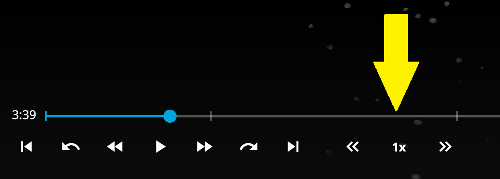

Note: This script is compatible with the [Jellyfin-VideoOSD-CustomPlaybackSpeed-Menu](https://github.com/chrissix666/Jellyfin-VideoOSD-CustomPlaybackSpeed-Menu).  
If the Custom Playback Speed Menu is installed, this script uses its configured speed values automatically. If it is not installed, this script falls back to the Jellyfin vanilla playback speed values.

Note: This script is also compatible with the [Jellyfin-VideoOSD-CustomOnOff-Menu](https://github.com/chrissix666/Jellyfin-VideoOSD-CustomOnOff-Menu).

# Jellyfin VideoOSD Custom Playback Speed Buttons

Adds custom playback speed buttons to the **Jellyfin Web VideoOSD**, letting you step through configured speed values and reset playback speed with one click during video playback.

This script adds quick speed step controls directly into the VideoOSD transport bar.  
It can use custom speed values from the Custom Playback Speed Menu script if available, or fall back to Jellyfin’s default playback speed values.

Tested on & Requirements: Windows 11, Chrome, Jellyfin Web 10.10.7, JavaScript Injector.

---

## Features

- Adds playback speed step buttons directly to the Jellyfin VideoOSD.
- Lets you step up or down through available playback speed values.
- Shows the current playback speed in a small center field.
- Clicking the speed field resets playback speed to `1x`.
- Uses custom speed values when available from the Custom Playback Speed Menu script.
- Falls back to Jellyfin’s vanilla playback speed values if no custom list is available.
- Can be toggled through the Custom On/Off Menu if installed.
- Works fully client-side, without backend changes.

---

## Behavior

The buttons are added next to the VideoOSD playback controls.

The left button steps to the next lower available playback speed.  
The right button steps to the next higher available playback speed.  
The center field displays the currently active playback speed and resets the video to `1x` when clicked.

If the Custom Playback Speed Menu script is installed and provides a custom speed list, this script uses that list automatically.  
If no custom speed list is found, the script uses the Jellyfin vanilla playback speed values.

Default fallback speeds:

- 0.5x
- 0.75x
- 1x
- 1.25x
- 1.5x
- 1.75x
- 2x
- 2.5x
- 3x
- 3.5x
- 4x

---

## Installation

1. If not already present, install a JavaScript injector plugin or userscript manager  
   (Jellyfin JavaScript Injector, Tampermonkey, Violentmonkey, or similar).

2. Paste the content of the Custom Playback Speed Buttons script into the injector.

3. Optional: Install the Custom Playback Speed Menu script if you want to define your own speed values.

4. Optional: Install the Custom On/Off Menu script if you want to toggle this script directly from the VideoOSD submenu.

5. Save and reload Jellyfin Web.

6. Start video playback and open the VideoOSD.

---

## Notes and Limitations

- This script changes the browser video playback rate only.
- Behavior depends on the browser video engine, especially at very low or very high speeds.
- Very low speed values may cause choppy playback or audio behavior depending on the browser.
- The buttons hide automatically on smaller window widths, matching the same responsive behavior as Jellyfin’s chapter jump buttons.
- Custom Playback Speed Menu integration is optional.
- Custom On/Off Menu integration is optional.
- No Jellyfin server setting is changed.
- No backend interaction is required.

---

## Tested On

- Jellyfin Web 10.10.7
- Google Chrome
- Windows 11

---

## License

MIT
